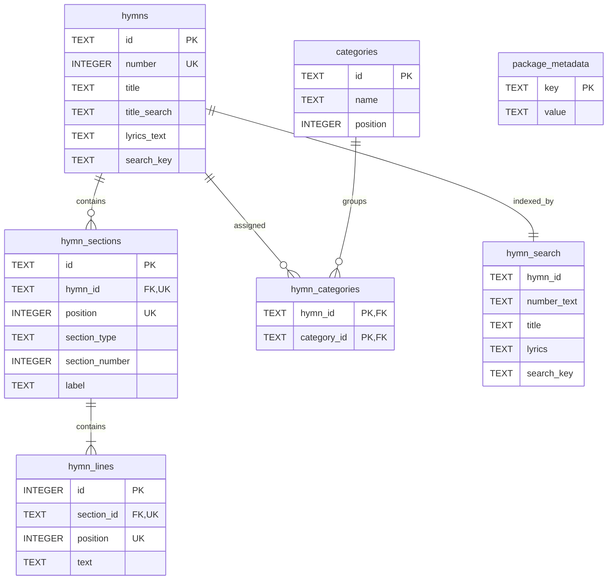

```mermaid
erDiagram
    hymns ||--o{ hymn_sections : contains
    hymn_sections ||--|{ hymn_lines : contains
    hymns ||--o{ hymn_categories : assigned
    categories ||--o{ hymn_categories : groups
    hymns ||--|| hymn_search : indexed_by

    package_metadata {
        TEXT key PK
        TEXT value
    }

    hymns {
        TEXT id PK
        INTEGER number UK
        TEXT title
        TEXT title_search
        TEXT lyrics_text
        TEXT search_key
    }

    hymn_sections {
        TEXT id PK
        TEXT hymn_id FK, UK
        INTEGER position UK
        TEXT section_type
        INTEGER section_number
        TEXT label
    }

    hymn_lines {
        INTEGER id PK
        TEXT section_id FK, UK
        INTEGER position UK
        TEXT text
    }

    categories {
        TEXT id PK
        TEXT name
        INTEGER position
    }

    hymn_categories {
        TEXT hymn_id PK, FK
        TEXT category_id PK, FK
    }

    hymn_search {
        TEXT hymn_id
        TEXT number_text
        TEXT title
        TEXT lyrics
        TEXT search_key
    }
```
